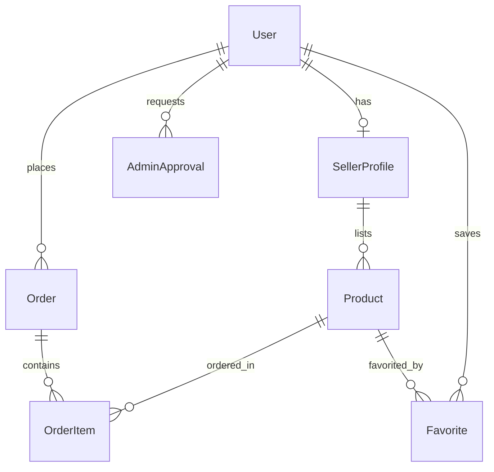

<](https://nestjs.com/)
[](https://nextjs.org/)
[](https://www.prisma.io/)
[](https://supabase.com/)
[](https://tailwindcss.com/)

</div>

---

## 📋 Table of Contents

- [Overview](#-overview)
- [Architecture](#-architecture)
- [Tech Stack](#-tech-stack)
- [Monorepo Structure](#-monorepo-structure)
- [Getting Started](#-getting-started)
- [Environment Variables](#-environment-variables)
- [Database](#-database)
- [API Reference](#-api-reference)
- [Deployment](#-deployment)
- [Contributing](#-contributing)
- [License](#-license)

---

## 🌟 Overview

Vendly is a **campus marketplace platform** that connects student buyers with campus sellers. Sellers can create stores, list products with images and videos, and manage incoming orders — all from a sleek, mobile-first dashboard. Buyers browse products, filter by category and price, save favorites, add items to a cart, and place orders with delivery or pickup options.

### Key Features

| Feature | Description |
|---|---|
| 🏪 **Seller Stores** | Sellers create branded stores with logos, bios, locations, and custom links |
| 📦 **Product Management** | CRUD with up to 3 images and 1 video per product via Cloudinary |
| 🔍 **Global Search** | Real-time, animated search modal across all products |
| 🏷️ **Filtering & Sorting** | Category pills, price range, sort by price/date, mobile bottom-sheet |
| ❤️ **Favorites / Wishlist** | Persistent, database-backed favorites with optimistic UI |
| 🛒 **Shopping Cart** | Client-side cart with checkout flow (delivery or pickup) |
| 📬 **Order Management** | Buyer and seller order views with status tracking |
| 🔐 **Authentication** | JWT-based with email verification, password reset, and role-based access |
| 🛡️ **Admin Panel** | Separate admin app for seller verification approvals and platform stats |
| 🌗 **Dark Mode** | Full theme support across the storefront |

---

## 🏗 Architecture

```
┌─────────────────────────────────────────────────────────────────┐
│                        Vendly Monorepo                          │
├──────────────┬──────────────────┬────────────────────────────────┤
│  apps/web    │   apps/admin     │          apps/api              │
│  (Next.js)   │   (Next.js)      │         (NestJS)               │
│  Port 3000   │   Port 3001      │         Port 1000              │
│              │                  │                                │
│  Storefront  │  Admin Panel     │  REST API                      │
│  • Browse    │  • Approvals     │  • Auth     • Products         │
│  • Cart      │  • Stats         │  • Stores   • Orders           │
│  • Favorites │  • Reviews       │  • Favorites                   │
│  • Orders    │                  │  • Email    • Cloudinary        │
│  • Dashboard │                  │                                │
└──────┬───────┴────────┬─────────┴──────────────┬─────────────────┘
       │                │                        │
       │     HTTP/REST (JSON)                    │
       └────────────────┼────────────────────────┘
                        │
              ┌─────────▼──────────┐
              │   PostgreSQL       │
              │   (Supabase)       │
              │   + Prisma ORM     │
              └────────────────────┘
                        │
              ┌─────────▼──────────┐
              │   Cloudinary       │
              │   (Media Storage)  │
              └────────────────────┘
```

---

## 🧰 Tech Stack

### Backend (`apps/api`)
| Technology | Purpose |
|---|---|
| **NestJS 11** | API framework with modular architecture |
| **Prisma 7** | ORM with PostgreSQL driver adapter |
| **PostgreSQL** | Primary database (hosted on Supabase) |
| **Passport + JWT** | Authentication and authorization |
| **Cloudinary** | Image and video storage |
| **Resend** | Transactional email delivery |
| **bcrypt** | Password hashing |

### Frontend (`apps/web`)
| Technology | Purpose |
|---|---|
| **Next.js 16** | React framework with App Router |
| **Tailwind CSS 4** | Utility-first styling |
| **Framer Motion** | Animations and transitions |
| **Lucide React** | Icon library |
| **Zustand** | Lightweight state management |
| **React Hook Form + Zod** | Form handling and validation |
| **Sonner** | Toast notifications |

### Admin (`apps/admin`)
| Technology | Purpose |
|---|---|
| **Next.js 16** | Admin dashboard framework |
| **Tailwind CSS 4** | Styling |
| **Framer Motion** | Animations |
| **Lucide React** | Icons |

---

## 📁 Monorepo Structure

```
vendly/
├── apps/
│   ├── api/                    # NestJS REST API (Port 1000)
│   │   ├── prisma/             # Database schema & config
│   │   ├── src/
│   │   │   ├── auth/           # Authentication & authorization
│   │   │   ├── product/        # Product CRUD & search
│   │   │   ├── store/          # Seller store management
│   │   │   ├── order/          # Order lifecycle
│   │   │   ├── favorite/       # Wishlist / favorites
│   │   │   ├── email/          # Transactional emails (Resend)
│   │   │   ├── common/         # Cloudinary, filters, shared
│   │   │   └── prisma/         # Database client service
│   │   └── package.json
│   │
│   ├── web/                    # Next.js Storefront (Port 3000)
│   │   ├── app/                # App Router pages
│   │   │   ├── (auth)/         # Login, register, verify, reset
│   │   │   ├── dashboard/      # Seller dashboard
│   │   │   ├── products/       # Product listings
│   │   │   ├── product/        # Product detail
│   │   │   ├── cart/           # Shopping cart
│   │   │   ├── favorites/      # Wishlist page
│   │   │   ├── orders/         # Order history
│   │   │   ├── s/              # Public store pages (/s/:link)
│   │   │   └── create-store/   # Store onboarding
│   │   ├── components/         # Reusable UI components
│   │   ├── lib/                # Contexts, API utils, validations
│   │   └── package.json
│   │
│   └── admin/                  # Next.js Admin Panel (Port 3001)
│       ├── app/
│       │   ├── (auth)/         # Admin login
│       │   └── (back-office)/  # Dashboard, approvals, stats
│       ├── services/           # API service layer
│       └── package.json
│
└── README.md                   # ← You are here
```

---

## 🚀 Getting Started

### Prerequisites

- **Node.js** ≥ 20
- **npm** ≥ 10
- A **PostgreSQL** database (Supabase recommended)
- A **Cloudinary** account
- A **Resend** account (for emails)

### 1. Clone the Repository

```bash
git clone https://github.com/alikamatu/vendly.git
cd vendly
```

### 2. Install Dependencies

Each app manages its own dependencies:

```bash
# API
cd apps/api && npm install

# Web storefront
cd ../web && npm install

# Admin panel
cd ../admin && npm install
```

### 3. Configure Environment Variables

Copy the example `.env` files and fill in your values:

```bash
# API (.env required)
cp apps/api/.env.example apps/api/.env

# Web
cp apps/web/.env.example apps/web/.env
```

See the [Environment Variables](#-environment-variables) section for full details.

### 4. Set Up the Database

```bash
cd apps/api

# Generate the Prisma Client
npx prisma generate

# Push the schema to your database
npx prisma db push
```

### 5. Start Development Servers

Open three terminal windows:

```bash
# Terminal 1 — API (Port 1000)
cd apps/api && npm run start:dev

# Terminal 2 — Web (Port 3000)
cd apps/web && npm run dev

# Terminal 3 — Admin (Port 3001)
cd apps/admin && npm run dev
```

---

## 🔑 Environment Variables

### `apps/api/.env`

| Variable | Description | Example |
|---|---|---|
| `DATABASE_URL` | PostgreSQL connection string (pooled) | `postgresql://...@pooler.supabase.com:6543/postgres?pgbouncer=true` |
| `DIRECT_URL` | Direct PostgreSQL connection (for migrations) | `postgresql://...@pooler.supabase.com:5432/postgres` |
| `JWT_SECRET` | Secret key for JWT token signing | `your-super-secret-jwt-key` |
| `JWT_EXPIRES_IN` | Token expiration duration | `7d` |
| `RESEND_API_KEY` | Resend API key for emails | `re_xxxx` |
| `RESEND_FROM_EMAIL` | Sender email address | `noreply@yourdomain.com` |
| `FRONTEND_URL` | Web app URL (for email links) | `http://localhost:3000` |
| `BACKEND_URL` | API URL | `http://localhost:1000` |
| `PORT` | API server port | `1000` |
| `CLOUDINARY_CLOUD_NAME` | Cloudinary cloud name | `your_cloud` |
| `CLOUDINARY_API_KEY` | Cloudinary API key | `123456789` |
| `CLOUDINARY_API_SECRET` | Cloudinary API secret | `your_secret` |

### `apps/web/.env`

| Variable | Description | Example |
|---|---|---|
| `NEXT_PUBLIC_API_URL` | Backend API URL | `http://localhost:1000` |

---

## 🗄 Database

### Schema Overview

The database contains **8 models** managed by Prisma 7:

| Model | Description |
|---|---|
| `User` | Registered users with roles (USER, SELLER, ADMIN) |
| `SellerProfile` | One-to-one with User; store metadata |
| `Product` | Listed items with images, attributes, pricing |
| `Order` | Purchase records with checkout info |
| `OrderItem` | Individual items within an order |
| `Category` | Product categories with dynamic field configs |
| `AdminApproval` | Seller verification workflow records |
| `Favorite` | User-product wishlist entries |

### Entity Relationship Diagram



### Key Commands

```bash
# Generate Prisma Client after schema changes
npx prisma generate

# Push schema to database (development)
npx prisma db push

# Open Prisma Studio (visual database browser)
npx prisma studio
```

> **Important (Prisma 7):** Database URLs are configured in `prisma.config.js`, not in `schema.prisma`. For schema migrations, use the `DIRECT_URL` (port 5432) — not the pooled connection (port 6543).

---

## 📡 API Reference

All endpoints are prefixed with the API base URL (`http://localhost:1000`).

### Authentication (`/auth`)

| Method | Endpoint | Auth | Description |
|---|---|---|---|
| `POST` | `/auth/register` | ✗ | Register a new user |
| `POST` | `/auth/login` | ✗ | Login and receive JWT |
| `GET` | `/auth/me` | ✓ | Get current user profile |
| `POST` | `/auth/verify-email` | ✗ | Verify email with token |
| `POST` | `/auth/forgot-password` | ✗ | Request password reset |
| `POST` | `/auth/reset-password` | ✗ | Reset password with token |
| `POST` | `/auth/submit-verification` | ✓ | Submit seller verification doc |
| `GET` | `/auth/approval-status` | ✓ | Check verification status |
| `POST` | `/auth/logout` | ✓ | Logout (blacklist token) |
| `PATCH` | `/auth/profile` | ✓ | Update user profile |

### Admin (`/admin`)

| Method | Endpoint | Auth | Description |
|---|---|---|---|
| `GET` | `/admin/approvals` | ADMIN | List verification requests |
| `GET` | `/admin/stats` | ADMIN | Platform statistics |
| `PATCH` | `/admin/approve/:id` | ADMIN | Approve/reject a seller |

### Stores (`/stores`)

| Method | Endpoint | Auth | Description |
|---|---|---|---|
| `POST` | `/stores` | SELLER | Create a store |
| `PATCH` | `/stores` | SELLER | Update store info |
| `GET` | `/stores/stats` | SELLER | Dashboard statistics |
| `GET` | `/stores/link/:link` | ✗ | Get store by its public link |

### Products (`/products`)

| Method | Endpoint | Auth | Description |
|---|---|---|---|
| `POST` | `/products` | SELLER | Create a product |
| `GET` | `/products` | ✗ | List all products |
| `GET` | `/products/categories` | ✗ | List categories |
| `GET` | `/products/search?q=` | ✗ | Search products |
| `GET` | `/products/:id` | ✗ | Get product by ID |
| `GET` | `/products/store/:link` | ✗ | Products by store |
| `GET` | `/products/seller/me` | SELLER | My listed products |
| `PUT` | `/products/:id` | SELLER | Update a product |
| `DELETE` | `/products/:id` | SELLER | Delete a product |

### Orders (`/orders`)

| Method | Endpoint | Auth | Description |
|---|---|---|---|
| `POST` | `/orders` | ✓ | Place an order |
| `GET` | `/orders/buyer` | ✓ | My purchase history |
| `GET` | `/orders/seller` | ✓ | Orders received (seller) |
| `GET` | `/orders/:id` | ✓ | Order details |
| `POST` | `/orders/:id/status` | ✓ | Update order status |

### Favorites (`/favorites`)

| Method | Endpoint | Auth | Description |
|---|---|---|---|
| `POST` | `/favorites/:productId` | ✓ | Toggle favorite |
| `GET` | `/favorites` | ✓ | List all favorites |
| `GET` | `/favorites/ids` | ✓ | Get favorited product IDs |

---

## 🚢 Deployment

### API

The NestJS API can be deployed to any Node.js host:

```bash
cd apps/api
npm run build
npm run start:prod
```

### Web & Admin

Both Next.js apps can be deployed to Vercel:

```bash
cd apps/web   # or apps/admin
npm run build
npm start
```

### Environment Considerations

- Use `DIRECT_URL` (port 5432) for database migrations
- Use `DATABASE_URL` (pooled, port 6543) for runtime queries
- Set `FRONTEND_URL` to your deployed web URL for email links
- Configure CORS in `main.ts` with your production domains

---

## 🤝 Contributing

1. Fork the repository
2. Create a feature branch: `git checkout -b feature/my-feature`
3. Commit your changes: `git commit -m 'Add my feature'`
4. Push to the branch: `git push origin feature/my-feature`
5. Open a Pull Request

---

## 📄 License

This project is **UNLICENSED** (private).

---

<div align="center">

**Built with ❤️ for campus communities**

</div>
]]>
